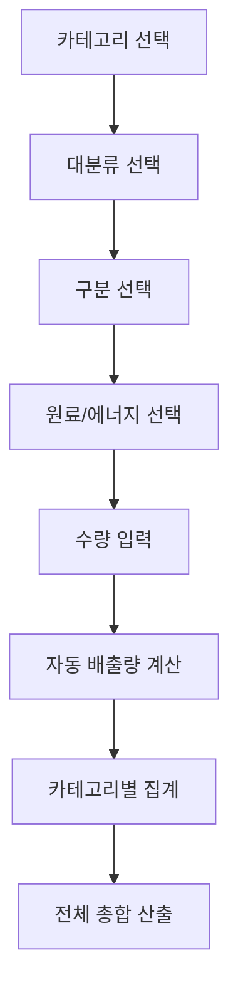

# 🌍 Scope 3 배출량 관리 시스템 가이드

## 📋 목차

1. [Scope 3란 무엇인가?](#scope-3란-무엇인가)
2. [시스템 개요](#시스템-개요)
3. [15개 카테고리 상세 설명](#15개-카테고리-상세-설명)
4. [배출량 계산 공식](#배출량-계산-공식)
5. [시스템 작동 방식](#시스템-작동-방식)
6. [사용자 가이드](#사용자-가이드)
7. [기술적 구현](#기술적-구현)

---

## 🎯 Scope 3란 무엇인가?

### ESG 배출량 분류 체계

```
📊 기업 온실가스 배출량 분류 (GHG Protocol 기준)

├── 🏭 Scope 1 (직접 배출)
│   ├── 연료 연소 (보일러, 발전기 등)
│   ├── 공정 배출 (화학반응 등)
│   └── 이동 연소 (회사 차량 등)
│
├── ⚡ Scope 2 (간접 배출 - 에너지)
│   ├── 전력 사용
│   └── 스팀/열 사용
│
└── 🌐 Scope 3 (기타 간접 배출) ← 이 시스템!
    ├── 업스트림 (8개 카테고리)
    ├── 다운스트림 (7개 카테고리)
    └── 총 15개 카테고리
```

### Scope 3의 중요성

- **전체 배출량의 70-90%**: 대부분 기업에서 Scope 3가 가장 큰 비중
- **공급망 전체**: 원료 조달부터 제품 폐기까지 전 생애주기
- **CSDDD 의무 공시**: EU 기업지속가능성 실사지침에서 필수 항목

---

## 🏗️ 시스템 개요

### 핵심 기능



### 데이터 흐름

1. **CSV 배출계수 로딩** → `/co2.csv` 파일에서 배출계수 데이터 로드
2. **연쇄 선택 시스템** → 대분류 → 구분 → 원료/에너지 순차 선택
3. **실시간 계산** → 수량 입력 시 즉시 배출량 계산
4. **카테고리별 집계** → 각 카테고리별 소계 관리
5. **전체 총합** → 15개 카테고리 총 배출량 산출

---

## 📊 15개 카테고리 상세 설명

### 🔼 업스트림 카테고리 (1-8번)

#### 1️⃣ 구매한 상품 및 서비스

- **설명**: 회사가 구매하는 모든 상품과 서비스의 생산 과정에서 발생하는 배출량
- **예시**: 사무용품, IT장비, 컨설팅 서비스, 청소 서비스
- **계산 방법**: 구매금액 × 배출계수 또는 수량 × 배출계수

#### 2️⃣ 자본재

- **설명**: 회사가 구매하거나 취득하는 자본재의 생산 과정 배출량
- **예시**: 건물, 기계, 차량, 컴퓨터, 사무용 가구
- **특징**: 내용연수에 걸쳐 분할 계산 가능

#### 3️⃣ 연료 및 에너지 관련 활동

- **설명**: Scope 1, 2에 포함되지 않은 연료/에너지 관련 배출량
- **포함 항목**:
  - 연료 추출, 생산, 운송
  - 전력 송배전 손실
  - 재생에너지 인증서

#### 4️⃣ 업스트림 운송 및 유통

- **설명**: 구매한 상품의 운송 및 유통 과정 배출량
- **예시**:
  - 공급업체 → 회사 운송
  - 제3자 물류 서비스
  - 창고 보관

#### 5️⃣ 폐기물 처리

- **설명**: 회사 운영 과정에서 발생한 폐기물 처리 시 배출량
- **포함**: 폐기물 운송, 처리, 재활용 과정
- **예시**: 일반폐기물, 재활용품, 유해폐기물

#### 6️⃣ 사업장 관련 활동

- **설명**: 출장을 제외한 사업 관련 활동 배출량
- **예시**:
  - 임차 건물 운영
  - 회사 행사
  - 프랜차이즈 운영

#### 7️⃣ 직원 통근

- **설명**: 직원들이 집과 회사 간 통근 시 발생하는 배출량
- **계산 요소**:
  - 교통수단별 배출계수
  - 통근 거리
  - 근무일수

#### 8️⃣ 출장

- **설명**: 업무상 출장으로 인한 교통수단 이용 배출량
- **포함**: 항공, 철도, 자동차, 숙박

### 🔽 다운스트림 카테고리 (9-15번)

#### 9️⃣ 다운스트림 운송 및 유통

- **설명**: 회사가 판매한 제품의 운송 및 유통 과정 배출량
- **예시**: 회사 → 고객 배송, 소매점 유통

#### 🔟 판매 후 처리

- **설명**: 판매한 제품의 가공, 사용, 폐기 과정 배출량
- **예시**: 중간재 제품의 후속 가공

#### 1️⃣1️⃣ 제품 사용

- **설명**: 판매한 제품을 고객이 사용할 때 발생하는 배출량
- **예시**:
  - 전자제품 전력 소비
  - 자동차 연료 소비
  - 소프트웨어 서버 운영

#### 1️⃣2️⃣ 제품 폐기

- **설명**: 판매한 제품의 수명 종료 후 폐기 처리 시 배출량
- **포함**: 폐기물 운송, 처리, 재활용

#### 1️⃣3️⃣ 임대 자산

- **설명**: 회사가 임대한 자산의 운영 배출량 (Scope 1, 2 제외)
- **예시**: 임대 차량, 임대 장비

#### 1️⃣4️⃣ 프랜차이즈

- **설명**: 프랜차이즈 사업의 운영 배출량
- **적용**: 프랜차이즈 본사에서 계산

#### 1️⃣5️⃣ 투자

- **설명**: 투자 포트폴리오의 배출량
- **예시**:
  - 주식 투자
  - 채권 투자
  - 부동산 투자

---

## 🧮 배출량 계산 공식

### 기본 공식

```
🔢 배출량 (kgCO₂eq) = 활동량 × 배출계수

여기서:
- 활동량: 사용량, 구매량, 거리 등 (단위별로 다름)
- 배출계수: 단위당 CO₂ 배출량 (kgCO₂eq/단위)
```

### 시스템 내 계산 과정

#### 1단계: 배출계수 선택

```typescript
// CSV 데이터에서 해당하는 배출계수 찾기
const selectedItem = data.find(
  d =>
    d.category === state.category && // 대분류
    d.separate === state.separate && // 구분
    d.RawMaterial === state.rawMaterial // 원료/에너지
)
```

#### 2단계: 배출량 계산

```typescript
// 실시간 배출량 계산
const emission = parseFloat(quantity) * selectedItem.kgCO2eq
```

#### 3단계: 집계

```typescript
// 카테고리별 총 배출량
const categoryTotal = calculators.reduce((sum, calc) => sum + calc.emission, 0)

// 전체 총 배출량
const grandTotal = categories.reduce((sum, category) => sum + category.total, 0)
```

### 계산 예시

#### 예시 1: 사무용품 구매

```
📝 입력값:
- 대분류: "사무용품"
- 구분: "종이류"
- 원료/에너지: "A4 용지"
- 배출계수: 2.5 kgCO₂eq/kg
- 수량: 100 kg

💡 계산:
배출량 = 100 kg × 2.5 kgCO₂eq/kg = 250 kgCO₂eq
```

#### 예시 2: 직원 통근

```
🚗 입력값:
- 대분류: "교통"
- 구분: "승용차"
- 원료/에너지: "휘발유"
- 배출계수: 0.2 kgCO₂eq/km
- 수량: 50 km/일 × 20일 = 1,000 km

💡 계산:
배출량 = 1,000 km × 0.2 kgCO₂eq/km = 200 kgCO₂eq
```

---

## ⚙️ 시스템 작동 방식

### 사용자 인터페이스 흐름

```
🏠 메인 화면
├── 📋 카테고리 선택 화면
│   ├── 15개 카테고리 버튼 그리드
│   ├── 각 카테고리별 현재 배출량 표시
│   └── 전체 총 배출량 표시
│
└── 📝 카테고리별 입력 화면
    ├── 🔄 연쇄 선택 시스템
    │   ├── 1️⃣ 대분류 선택
    │   ├── 2️⃣ 구분 선택
    │   ├── 3️⃣ 원료/에너지 선택
    │   └── 4️⃣ 수량 입력
    │
    ├── ➕ 계산기 추가/삭제
    ├── 📊 실시간 배출량 표시
    ├── 🧮 카테고리 소계
    └── 🔙 완료/취소 버튼
```

### 데이터 관리 구조

#### 상태 관리

```typescript
// 현재 선택된 카테고리
const [activeCategory, setActiveCategory] = useState<string | null>(null)

// 카테고리별 계산기 목록
const [categoryCalculators, setCategoryCalculators] = useState<{
  [category: string]: Calculator[]
}>({})

// 카테고리별 배출량 총계
const [categoryTotals, setCategoryTotals] = useState<{
  [category: string]: {id: number; emission: number}[]
}>({})
```

#### 계산기 상태

```typescript
type SelectorState = {
  category: string // 대분류
  separate: string // 구분
  rawMaterial: string // 원료/에너지
  quantity: string // 수량
}
```

### 실시간 계산 로직

#### 1. 배출계수 자동 선택

```typescript
useEffect(() => {
  // 사용자가 대분류, 구분, 원료를 모두 선택하면
  // CSV 데이터에서 해당하는 배출계수 자동 검색
  const selectedItem = data.find(
    d =>
      d.category === state.category &&
      d.separate === state.separate &&
      d.RawMaterial === state.rawMaterial
  )
  setSelectedItem(selectedItem)
}, [state.category, state.separate, state.rawMaterial])
```

#### 2. 수량 입력 시 즉시 계산

```typescript
const handleQuantityChange = (value: string) => {
  const quantity = parseFloat(value)

  if (selectedItem && !isNaN(quantity)) {
    // 실시간 배출량 계산
    const emission = quantity * selectedItem.kgCO2eq
    onChangeTotal(id, emission)
  }
}
```

#### 3. 카테고리별 집계

```typescript
const totalEmission = (category: string) =>
  (categoryTotals[category] || []).reduce((sum, item) => sum + item.emission, 0)
```

---

## 📖 사용자 가이드

### 기본 사용법

#### Step 1: 카테고리 선택

1. 메인 화면에서 15개 카테고리 중 하나 선택
2. 각 버튼에는 현재 입력된 배출량이 표시됨
3. 클릭하면 해당 카테고리 입력 화면으로 이동

#### Step 2: 데이터 입력

1. **대분류 선택**: 드롭다운에서 적절한 대분류 선택
2. **구분 선택**: 대분류에 따라 자동으로 구분 옵션 표시
3. **원료/에너지 선택**: 구분에 따라 자동으로 원료 옵션 표시
4. **수량 입력**: 해당 단위로 수량 입력
5. **배출량 확인**: 자동으로 계산된 배출량 확인

#### Step 3: 추가 입력 (선택사항)

- "입력 항목 추가" 버튼으로 같은 카테고리에 여러 항목 입력 가능
- 각 항목은 독립적으로 관리됨
- 삭제 버튼으로 불필요한 항목 제거 가능

#### Step 4: 완료 및 확인

- "입력 완료" 버튼으로 카테고리 입력 종료
- 메인 화면에서 카테고리별 소계 및 전체 총계 확인

### 💡 사용 팁

#### 효율적인 데이터 입력

```
✅ 권장 순서:
1. 큰 배출량부터 입력 (파레토 법칙 적용)
2. 데이터 수집이 쉬운 카테고리부터 시작
3. 추정값보다는 실측값 우선 사용

📋 카테고리별 우선순위:
높음: 1(구매상품), 3(연료에너지), 7(직원통근), 11(제품사용)
중간: 2(자본재), 4(업스트림운송), 9(다운스트림운송)
낮음: 5(폐기물), 6(사업장활동), 8(출장) 등
```

#### 데이터 품질 관리

- **단위 확인**: 입력 전 반드시 단위 확인
- **일관성 유지**: 같은 종류 데이터는 동일한 방법으로 입력
- **정기 업데이트**: 월/분기별 정기적 데이터 업데이트

---

## 🔧 기술적 구현

### 아키텍처 구조

```
📁 Scope3 시스템 구조
├── 📄 page.tsx (라우트 진입점)
├── 📄 scope3Form.tsx (메인 컴포넌트)
├── 📄 README.md (이 문서)
└── 📄 /public/co2.csv (배출계수 데이터)

🔄 컴포넌트 계층:
Scope3Form (메인)
├── ExcelCascadingSelector (계산기)
├── CategoryGrid (카테고리 선택)
└── SummaryDisplay (집계 표시)
```

### 핵심 기술 스택

#### Frontend

- **React 18**: 함수형 컴포넌트, Hooks
- **TypeScript**: 타입 안전성 보장
- **Tailwind CSS**: 반응형 스타일링
- **Papa Parse**: CSV 파일 파싱

#### 상태 관리

- **useState**: 로컬 상태 관리
- **useEffect**: 부수 효과 처리
- **useRef**: 참조값 추적

### 데이터 구조

#### CSV 배출계수 파일 구조

```csv
대분류,구분,원료/에너지,단위,탄소발자국
사무용품,종이류,A4 용지,kg,2.5
교통,승용차,휘발유,km,0.2
전력,일반전력,한국전력,kWh,0.459
...
```

#### TypeScript 타입 정의

```typescript
// 배출계수 데이터 타입
interface CO2Data {
  category: string // 대분류
  separate: string // 구분
  RawMaterial: string // 원료/에너지
  unit: string // 단위
  kgCO2eq: number // 탄소발자국
}

// 계산기 상태 타입
type SelectorState = {
  category: string // 선택된 대분류
  separate: string // 선택된 구분
  rawMaterial: string // 선택된 원료
  quantity: string // 입력된 수량
}
```

### 성능 최적화

#### 불필요한 재계산 방지

```typescript
// useRef로 이전 값 추적
const prevSelectedItemRef = useRef<CO2Data | null>(null)

// 배출계수가 실제로 변경된 경우에만 재계산
if (selected && prevSelectedItemRef.current !== selected) {
  // 배출량 재계산
  const emission = quantity * selected.kgCO2eq
  onChangeTotal(id, emission)
}
```

#### 메모이제이션 활용

```typescript
// 중복 제거 함수
const unique = (arr: string[]) => [...new Set(arr)]

// 필터링된 옵션 생성
const categoryList = unique(data.map(d => d.category))
const separateList = unique(
  data.filter(d => d.category === state.category).map(d => d.separate)
)
```

### 에러 처리

#### 입력값 검증

```typescript
const handleQuantityChange = (value: string) => {
  // 빈 값 처리
  if (value === '') {
    onChangeTotal(id, 0)
    return
  }

  // 숫자 유효성 검증
  const num = parseFloat(value)
  if (isNaN(num)) {
    alert('숫자를 입력해주세요.')
    onChangeTotal(id, 0)
    return
  }

  // 정상 계산
  if (selectedItem) {
    const emission = num * selectedItem.kgCO2eq
    onChangeTotal(id, emission)
  }
}
```

#### CSV 로딩 에러 처리

```typescript
useEffect(() => {
  fetch('/co2.csv')
    .then(res => res.text())
    .then(csvText => {
      // CSV 파싱 및 데이터 설정
      const parsed = Papa.parse(csvText, {header: true})
      setData(parsed.data)
    })
    .catch(error => {
      console.error('CSV 데이터 로딩 실패:', error)
      // 사용자에게 에러 알림
    })
}, [])
```

---

## 📈 향후 개선 계획

### 기능 확장

- [ ] **데이터 내보내기**: Excel, PDF 리포트 생성
- [ ] **데이터 가져오기**: Excel 파일 일괄 업로드
- [ ] **시계열 분석**: 월별, 연도별 트렌드 분석
- [ ] **벤치마킹**: 업계 평균과 비교

### 사용성 개선

- [ ] **자동 저장**: 입력 중 자동 저장 기능
- [ ] **템플릿**: 업종별 입력 템플릿 제공
- [ ] **도움말**: 카테고리별 상세 가이드
- [ ] **검색 기능**: 배출계수 빠른 검색

### 기술적 개선

- [ ] **캐싱**: 배출계수 데이터 캐싱
- [ ] **오프라인 지원**: PWA 구현
- [ ] **실시간 동기화**: 다중 사용자 협업
- [ ] **API 연동**: 외부 배출계수 DB 연동

---

## 🤝 문의 및 지원

### 기술 지원

- **개발팀**: ESG Project Team
- **버전**: 1.0
- **최종 업데이트**: 2024

### 관련 문서

- [Scope 1 가이드](../scope1/README.md)
- [Scope 2 가이드](../scope2/README.md)
- [CSDDD 공시 가이드](../../CSDDD/README.md)

---

_이 문서는 Scope 3 배출량 관리 시스템의 이해를 돕기 위해 작성되었습니다. 추가 질문이나 개선 사항이 있으시면 언제든 연락해 주세요._
